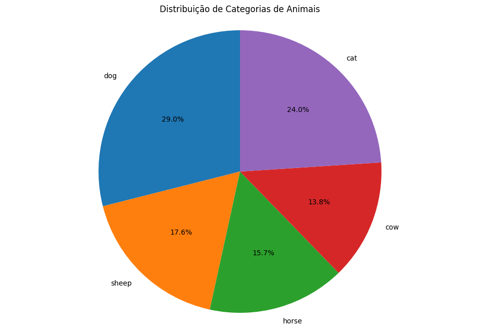
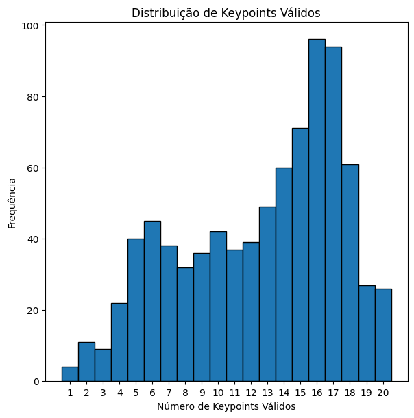
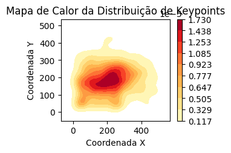
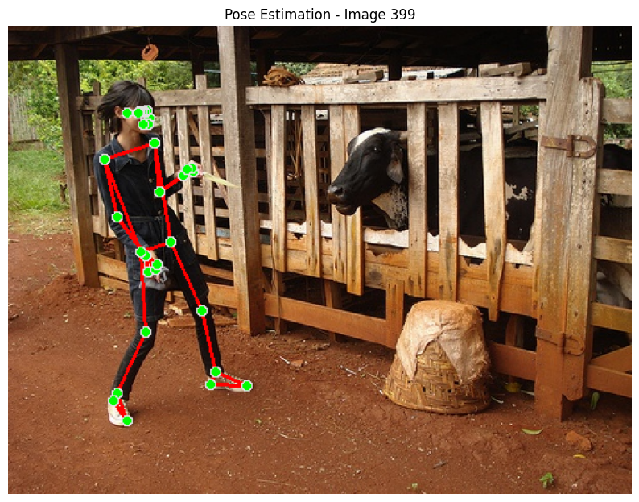

# Conclusões

## Resumo do Projeto

Este projeto teve como objetivo desenvolver um modelo de estimação de pose para bovinos, utilizando o conjunto de dados ANIMAL-POSE DATASET e adaptando técnicas de detecção de pose humana. O foco principal foi a aplicação e adaptação de modelos de estimação de pose, como o MediaPipe, para a análise de posturas de bovinos.

## Principais Aprendizados

1. **Diversidade do Dataset**: 
   - A análise da distribuição de categorias de animais revelou uma representação desigual, com bovinos sendo a categoria menos representada entre as cinco principais (cães, gatos, ovelhas, cavalos e vacas).
   - Esta descoberta destaca a importância de considerar o balanceamento de classes em tarefas de aprendizado de máquina multi-classe.

2. **Variabilidade de Keypoints**:
   - Observou-se uma variação significativa no número de keypoints válidos por imagem (de 1 a 20), com uma concentração maior entre 16 e 18 keypoints.
   - Esta variabilidade indica a necessidade de estratégias robustas para lidar com dados de entrada inconsistentes.

3. **Distribuição Espacial de Keypoints**:
   - O mapa de calor da distribuição de keypoints mostrou uma concentração na região central das imagens.
   - Este padrão sugere um viés potencial no dataset e a necessidade de diversificar as posições dos animais nas imagens de treinamento.

4. **Adaptabilidade de Modelos Humanos**:
   - A aplicação bem-sucedida de um modelo de pose humana em um bovino demonstrou o potencial de transferência de aprendizado entre espécies.
   - No entanto, também destacou a necessidade de ajustes específicos como o finetuning nos modelos para acomodar as diferenças anatômicas.

## Limitações do Trabalho

1. **Esquema de Keypoints Não-Otimizado**: 
   - A utilização de um esquema de keypoints projetado para humanos limitou a capacidade de capturar com precisão a anatomia bovina.

2. **Viés de Posicionamento**: 
   - A concentração de keypoints no centro das imagens sugere um possível viés no dataset, o que pode afetar o desempenho do modelo em cenários reais com posicionamentos variados.

3. **Validação Limitada**: 
   - A falta de um conjunto de validação diversificado e específico para bovinos pode ter mascarado limitações importantes do modelo, de modo que algumas imnagens continham humanos com os bovinos.

## Sugestões para Trabalhos Futuros

1. **Desenvolvimento de Esquema de Keypoints Específico**:
   - Criar um esquema de keypoints adaptado à anatomia bovina, considerando pontos-chave relevantes para análise de postura e movimento de gado.

2. **Refinamento do Modelo**:
   - Utilizar técnicas de transfer learning, partindo de modelos pré-treinados em poses humanas, com fine-tuning extensivo em dados de bovinos.
   - Explorar arquiteturas de rede neural específicas para capturar características únicas da morfologia bovina.

3. **Validação Robusta**:
   - Desenvolver um conjunto de validação diversificado, incluindo bovinos em várias poses, ângulos e ambientes.
   - Implementar métricas de avaliação específicas para a estimação de pose em quadrúpedes.

4. **Análise de Erro Detalhada**:
   - Conduzir uma análise minuciosa dos erros de detecção, categorizando-os por tipo (e.g., falsos positivos, keypoints ausentes) e contexto (e.g., pose do animal, condições de iluminação).

## Metodologia para Trabalhos Futuros

1. **Coleta e Preparação de Dados**:
   - Expandir o dataset com foco em bovinos, assegurando diversidade de raças, idades e condições ambientais.
   - Implementar protocolos de anotação padronizados para garantir consistência nos keypoints.

2. **Desenvolvimento do Modelo**:
   - Adotar uma abordagem iterativa, começando com modelos simples e aumentando gradualmente a complexidade.
   - Utilizar técnicas de validação cruzada para avaliar a robustez do modelo em diferentes subconjuntos de dados.

3. **Avaliação e Refinamento**:
   - Estabelecer métricas de desempenho claras, como precisão de keypoints e consistência de detecção em sequências de vídeo.
   - Realizar testes de campo em ambientes reais de pecuária para validar a aplicabilidade prática do modelo.

4. **Documentação e Compartilhamento**:
   - Manter documentação detalhada de todos os experimentos, incluindo hiperparâmetros, arquiteturas de modelo e resultados.
   - Considerar a publicação do modelo e dataset em plataformas de código aberto para fomentar colaboração e avanços na área.

Ao seguir estas recomendações e abordar as limitações identificadas, futuros trabalhos nesta área têm o potencial de desenvolver sistemas de estimação de pose para bovinos mais precisos e aplicáveis, contribuindo significativamente para avanços em monitoramento de saúde animal, estudos comportamentais e gestão eficiente de rebanhos.